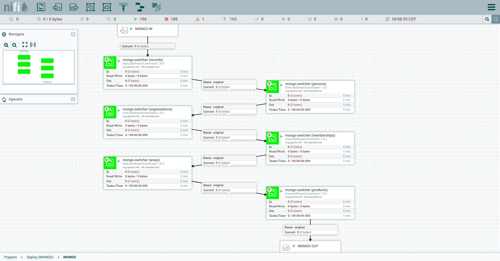

# Poppins

Poppins es un sistema de orquestación de pipelines de datos para realizar ETL. Está basada en Apache NiFi y es la pieza principal de la maquinaria de datos que alimenta la plataforma de datos abiertos QuienEsQuien.wiki.

La construcción de Poppins inicia en 2018, cuando la necesidad de importar y combinar datasets diversos de contratación pública en México requiere de la elaboración de un proceso formal, periódico y verificable de importación de datos. Las funciones principales del sistema son:

- a) Extraer datasets crudos de las distintas fuentes de datos.
- b) Transformarlos a su forma y estructura requerida para su uso desde la API de QQW.
- c) Extraer información sobre entidades contenida en estos datasets, y luego combinar toda la información extraída (personas, empresas y relaciones) junto con algunas métricas.
- d) Generar datasets nuevos a partir del análisis automatizado de toda la información (banderas rojas sobre contratos y entidades).
- e) Actualizar la base de datos principal en Elasticsearch para alimentar la API de QQW.

---

## 1. Desarrollo y Aspectos Técnicos

### 1.1 Ambiente de desarrollo (local)

Todos los nuevos pipelines y cambios a pipelines existentes deben realizarse en un ambiente de desarrollo local dedicado a este propósito. Es posible hacer cambios directamente en staging, pero éstos no persistirán si se reinicia el pod o se hace un nuevo deploy.

Los pasos para establecer un ambiente local son los siguientes:

1. Clonar el repositorio localmente desde [Github](https://github.com/ProjectPODER/poppins](https://github.com/ProjectPODER/poppins).
2. Descargar NiFi desde el [archivo](https://archive.apache.org/dist/nifi/1.9.0/) de versiones anteriores. La versión utilizada por Poppins es la 1.9.0. El archivo a descargar es [este](https://archive.apache.org/dist/nifi/1.9.0/nifi-1.9.0-bin.tar.gz).
3. Descomprimir el archivo en su propia carpeta. Esta carpeta será la raíz de NiFi.
4. Seguir las instrucciones de la [guía oficial](https://nifi.apache.org/docs/nifi-docs/html/getting-started.html#downloading-and-installing-nifi) para iniciar NiFi por primera vez. No es necesario configurar SSL ni usuarios.
5. Instalar NiFi como [servicio](https://nifi.apache.org/docs/nifi-docs/html/getting-started.html#installing-as-a-service) localmente (opcional).
6. Detener la ejecución de NiFi. Si instaló el servicio, utilizar el comando `sudo service nifi stop`. Si lo ejecutó directamente, ejecutar el comando `sudo ./bin/nifi.sh stop` desde la raíz de NiFi.
7. Del repositorio clonado, copiar la carpeta `certs/` a la raíz de NiFi.
8. Copiar y reemplazar los archivos dentro de la carpeta `conf/` del repositorio clonado a la carpeta `conf/` del NiFi recién instalado.
9. Iniciar NiFi.
10. En una ventana de navegador, ir a: `http://localhost:8484/nifi/`

Una vez establecido este ambiente de desarrollo, todos los cambios que se realicen desde la interfaz gráfica del navegador se guardarán automáticamente dentro del archivo `conf/flow.xml.gz`. El puerto configurado por defecto es el 8484 pero es posible cambiar esta y otras configuraciones en el archivo `conf/nifi.properties`.

Las siguientes variables de entorno deben estar configuradas (ver sección 4.6 de este documento):

- POPPINS_FILES_DIR: ruta a la raíz de los archivos internos y logs de Poppins.
- POPPINS_SCRIPTS_DIR: ruta a la carpeta donde se encuentran todos los scripts utilizados por Poppins.
- MONGO_HOST: (opcional) host para la instancia local de MongoDB. Default: localhost.
- MONGO_PORT: (opcional) puerto de la instancia local de MongoDB. Default: 27017.
- ELASTIC_HOST: (opcional) host para la instancia de Elasticsearch donde se subirán los índices generados por las importaciones. Default: localhost.
- ELASTIC_PORT: (opcional) puerto de la instancia de Elasticsearch. Default: 9200.
- ELASTIC_USER: (opcional) usuario de Elasticsearch.
- ELASTIC_PASS: (opcional) contraseña del usuario de Elasticsearch.

Para el funcionamiento correcto de Poppins se recomienda también [instalar y configurar un servidor local de MongoDB](https://docs.mongodb.com/manual/tutorial/install-mongodb-on-ubuntu/). Los scripts de interacción con Mongo están preparados para interactuar con una instalación default (localhost a través del puerto 27017).

### 1.2 Estructura interna de archivos y logs (poppins_files)

Toda actividad realizada por Poppins se registra de diversas maneras en el volumen persistente, ubicado en la ruta `/poppins_files/` dentro del contenedor principal del pod **fast-poppins-0**. Dentro de esta carpeta existe una subcarpeta para cada fuente de datos, incluyendo carpetas para procesos que generan datos nuevos a partir de otras fuentes. Por ejemplo, dentro de la carpeta `/poppins_files/compranet2019/` se encontrará toda la información correspondiente al pipeline de importación de esta fuente.

Dentro de cada subcarpeta encontraremos información relacionada a las importaciones realizadas sobre esa fuente. Tomando como ejemplo la fuente **compranet2019**, la estructura de archivos es la siguiente:

- **/poppins_files/compranet2019/**
    - **csv**: en esta carpeta se almacenan los archivos fuente descargados desde el sitio oficial de Compranet, descomprimidos y transformados a CSV.
    - **json**: en esta carpeta se almacenan los archivos convertidos de CSV a JSON. Utilizado principalmente para verificación.
    - **ocds**: en esta carpeta se almacenan los archivos convertidos de JSON al estándar OCDS (también en formato JSON). Utilizado principalmente para verificación.
    - **run**: dentro de esta carpeta encontramos múltiples subcarpetas cuyo nombre es el timestamp de la fecha de importación. Dentro de éstas encontramos un archivo JSON con el output del script **stream2db** para cada archivo que fue convertido durante esa importación. En este output se encuentra la cantidad de documentos nuevos insertados a Mongo.

Otro ejemplo, utilizando la carpeta `/poppins_files/contracts/` que representa una colección de datos generada a partir de las diversas fuentes de contratos:

- **/poppins_files/contracts/**
    - **json**: archivos JSON generados para subir a Elasticsearch. Cada corrida nueva sobreescribe los archivos viejos.
    - **run**: subcarpetas fechadas correspondientes a cada importación, y dentro de éstas varios archivos JSON con el output de **stream2db**.
        - **errors**: cuando **stream2db** encuentra un error durante su ejecución, el output se redirige a un archivo JSON dentro de esta carpeta.

La estructura de archivos puede variar según lo que sea requerido para cada fuente, siempre intentando mantener la lógica de una carpeta por fuente, subcarpetas con el formato del archivo para datos transformados, subcarpeta llamada **run** para almacenar logs de importaciones fechadas, y dentro de ésta una subcarpeta llamada **errors** para almacenar mensajes de error.

El listado completo de carpetas dentro de poppins_files es el siguiente:

- **cbmei**: contiene el archivo parseado y procesado por [cbmei2product](https://github.com/ProjectPODER/cbmei2product/) con información relacionada a la colección products.
- **compranet**: archivos fuente y procesados por [transformer-ocds](https://github.com/ProjectPODER/transformer-ocds) para la fuente Compranet 2011-2017.
- **compranet2019**: archivos procesados por [transformer-ocds](https://github.com/ProjectPODER/transformer-ocds) para la fuente Compranet 2018 en adelante.
- **compranet3**: archivos fuente y procesados por [transformer-ocds](https://github.com/ProjectPODER/transformer-ocds) para la fuente Compranet 3.0 (2001-2010).
- **contracts**: archivos procesados a partir de records OCDS por [record-decompiler](https://github.com/ProjectPODER/record-decompiler) para subir a Elastic.
- **entities**: logs de resultados de [stream2db](https://github.com/ProjectPODER/stream2db) para entidades extraídas, separados en carpetas para MongoDB y Elasticsearch.
- **entity_extract**: logs de resultados para [ocds-entity-extract](https://github.com/ProjectPODER/ocds-entity-extract), extractor de entidades.
- **exchange-rates**: archivos de conversiones de tipo de cambio entre monedas, generados por [exchange-rates-parser](https://github.com/ProjectPODER/exchange-rates-parser/).
- **latam_offshore**: archivos fuente y procesados por [latam-offshore-transformer](https://github.com/ProjectPODER/latam-offshore-transformer/) para la fuente LATAM Offshore.
- **lists**: contiene los listados clasificadores, de los cuales el único implementado es el resultado de [rupc-transformer](https://github.com/ProjectPODER/rupc-transformer/).
- **pot**: archivos fuentes y procesados por [transformer-ocds](https://github.com/ProjectPODER/transformer-ocds/) para la fuente POT.
- **records**: logs de resultados de [stream2db](https://github.com/ProjectPODER/stream2db/) para records OCDS compilados por [record-compiler](https://github.com/ProjectPODER/record-compiler/).
- **sicop**: carpeta temporal creada para el fork de la DB utilizado para el desarrollo de Todos los Contratos Costa Rica.
- **sitemap**: logs de generación y despliegue de los archivos producidos por [qqw-sitemap](https://github.com/ProjectPODER/qqw-sitemap/) para generar el mapa del sitio de QQW.
- **tdc**: archivos fuente y procesador por [transformer-ocds](https://github.com/ProjectPODER/transformer-ocds/) para la fuente Torre de Control.

### 1.3 Scripts

Algunos procesos dentro de Poppins son ejecutados a través de los procesadores disponibles por defecto dentro de Apache NiFi. Sin embargo, algunos procesos complejos (principalmente las transformaciones a estándares de datos abiertos) no pueden realizarse con alguno de los procesadores disponibles. Por lo tanto, se utiliza un procesador especial denominado [**ExecuteStreamProcessor**](https://nifi.apache.org/docs/nifi-docs/components/org.apache.nifi/nifi-standard-nar/1.9.0/org.apache.nifi.processors.standard.ExecuteStreamCommand/index.html) que permite la ejecución de scripts externos invocables desde un shell normal para la transformación de los datos.

Por su naturaleza abstracta, un *flowfile* es simplemente un conjunto de texto que puede transmitirse a un script por medio de stdin como si se tratara de un *pipe* de UNIX. Por lo tanto, un script capaz de leer texto desde stdin pude realizar operaciones arbitrarias sobre este texto y luego utilizar stdout como salida, generando un nuevo *flowfile* que puede ser recibido por NiFi y trasladado al siguiente procesador en la cadena.

Poppins aprovecha esta capacidad de NiFi para realizar una gran parte de su actividad a través de scripts de Node.js. Para utilizar un script particular desde dentro de Poppins, basta con agregar el script como un submódulo al repositorio de Poppins dentro de la carpeta `scripts/`, hacer un commit y luego hacer un deploy. El script se encontrará disponible dentro de una carpeta llamada `scripts/nombre_del_script/` ubicada en la raíz de NiFi dentro del pod.

Los scripts disponibles dentro de Poppins hasta el momento son los siguientes:

- [transformer-ocds](https://github.com/ProjectPODER/transformer-ocds): transformadora principal de contratos de todas las fuentes a releases OCDS.
- [stream2db](https://github.com/ProjectPODER/stream2db): transportador multiusos de documentos JSON a MongoDB y Elasticsearch.
- [mongo-indexer](https://github.com/ProjectPODER/mongo-indexer): creador de índices en colecciones de MongoDB.
- [ocds-unique](https://github.com/ProjectPODER/ocds-unique): generador de listados de IDs únicos a partir de conjuntos de colecciones de MongoDB.
- [record-compiler](https://github.com/ProjectPODER/record-compiler): compilador de releases a records de todos los tipos de entidad.
- [ocds-entity-extract](https://github.com/ProjectPODER/ocds-entity-extract): extractor de entidades a partir de una colección de records OCDS.
- [mongo-switcher](https://github.com/ProjectPODER/mongo-switcher): implementa el proceso de sufijos en las colecciones de MongoDB.
- [record-decompiler](https://github.com/ProjectPODER/record-decompiler): construye documentos con estructura plana a partir de records en MongoDB para enviar a Elasticsearch.
- [latam-offshore-transformer](https://github.com/ProjectPODER/latam-offshore-transformer): produce entidades a partir del CSV del dataset LATAM Offshore.
- [rupc-transformer](https://github.com/ProjectPODER/rupc-transformer): produce un listado clasificatorio de proveedores de contratos en México.
- [elastic-alias-switcher](https://github.com/ProjectPODER/elastic-alias-switcher): implementa el proceso de sufijos en los índices de Elasticsearch.
- [qqw-sitemap](https://github.com/ProjectPODER/qqw-sitemap): generador del sitemap de la plataforma QQW.
- [sicop-unifier](https://github.com/ProjectPODER/sicop_unifier): script especial para el dataset de SICOP (Costa Rica) que unifica items para producir contratos.
- [groucho](https://github.com/ProjectPODER/groucho): evaluador universal de banderas rojas sobre contratos OCDS.

#### 1.3.1 Agregar un nuevo script

El procedimiento para incluir un nuevo script dentro de Poppins agregándolo como un submodulo es el siguiente:

1. `git submodule add (url_repo + .git al final) scripts/repo_name`
2. Verificar el archivo .gitmodules en el repo de Poppins. Debe contener una entrada como la siguiente:
    ```
    [submodule "scripts/groucho"]
	    path = scripts/groucho
	    url = https://github.com/ProjectPODER/groucho.git
	    branch = main
    ```
3. Borrar todo el contenido de la carpeta scripts/repo_name (incluido .git).
4. `git submodule update --init --recursive --remote`

---

## 2. Datos

### 2.1 Estructuras de Datos

#### 2.1.1 Colecciones acumuladoras de contratos y entidades (MongoDB)

Dentro de Poppins, en un contenedor propio, se encuentra una instancia local de MongoDB donde se almacenan los documentos relacionados a las principales entidades de QQW, que son: areas, memberships, organizations, persons, products. Además, los contratos se agrupan en la colección maestra records que almacena procesos de contratación compilados según el estándar OCDS.

El procedimiento básico es el siguiente: se realiza una importación de datos de una fuente, transformando cada documento a su representación en el estándar correspondiente (OCDS para contratos utlizando [transformer-ocds](https://github.com/ProjectPODER/transformer-ocds), Popolo para entidades utilizando distintas transformadoras), que se denomina un *release*. Los documentos se acumulan en colecciones de MongoDB con la nomenclatura `entidad_fuente` (por ejemplo, `persons_mujeres` para las personas extraídas de la fuente Mujeres en la Bolsa). En una de las etapas del flujo principal de importación, los documentos de todas las fuentes para una entidad se compilan en un registro unificado, denominado *record*, utilizando el script [record-compiler](https://github.com/ProjectPODER/record-compiler). Los documentos se envían a MongoDB utilizando el script [stream2db](https://github.com/ProjectPODER/stream2db).

La metodología de *releases* y *records* deriva del estándar OCDS, pero se aplica también a entidades Popolo. Se utilizan colecciones para acumular documentos descargados y convertidos al formato de [*releases*](https://standard.open-contracting.org/latest/en/schema/reference/). Este formato permite insertar nuevos documentos a cada colección solamente cuando existan cambios o se trate de un nuevo contrato, lo cual se verifica utilizando un hash de todo el documento y asignándolo como *_id* dentro de la colección. Los releases luego se unifican hacia el formato de [*records*](https://standard.open-contracting.org/latest/en/schema/records_reference/) utilizando un identificador como criterio de unificación y pasando por un proceso que implementa la estrategia de [*merging*](https://standard.open-contracting.org/latest/en/schema/merging/) descrita por OCDS.

Para evitar pérdida de información, se sigue el siguiente procedimiento para deployar los nuevos datos, implementado dentro del script [mongo-switcher](https://github.com/ProjectPODER/mongo-switcher):

1. Los nuevos registros compilados se insertan a una colección temporal con el sufijo `_b`, por ejemplo **records_b**.
2. Si ya existe una colección con el sufijo `_old`, se elimina.
3. Se agrega el sufijo `_old` a la colección actual (**records** pasa a ser **records_old**).
4. Se quita el sufijo `_b` de la colección nueva (**records_b** pasa a ser **records**).

Como manera de asegurar la trazabilidad de los datos a lo largo de los diversos procesos que componen cada pipeline, cada documento generado posee dos propiedades universales de Poppins sin importar el tipo de dato que represente. Estas propiedades son:

- **source**: un array de objetos JSON, cada uno con la propiedad id, cuyo valor corresponde al identificador principal de cada fuente (por ejemplo, *compranet2019* o *latam_offshore*).
- **sourceRun**: un array de objetos JSON, cada uno con la propiedad id, cuyo valor corresponde al identificador principal de cada fuente, un guion, y el número correspondiente al timestamp de la importación en la cual fue generado (por ejemplo, *mujeres2020-1619230421207*).

Al ser arrays de objetos, cada vez que se realiza una compilación de alguna entidad, las propiedades source y sourceRun acumularán todos los valores únicos de sus respectivos releases. De esta manera, una entidad que aparece en fuentes distintas mantendrá el registro de todas las fuentes en las que se encuentra.

#### 2.1.2 Descripción de entidades

##### areas

La colección **areas** almacena información geográfica extraída de las distintas fuentes en un formato derivado del estándar de datos Popolo. Todas las areas corresponden a los niveles de país, estado, o ciudad/municipalidad, y contienen referencias al id de su entidad madre. Las areas se compilan a partir de las siguientes colecciones, una para cada fuente de datos que puede contener areas:

- **areas_latam_offshore**: dataset de empresas Latam Offshore, que contiene empresas con dueños latinoamericanos registradas en el Reino Unido.
- **areas_mujeres**: datos de bolsas de valores latinoamericanas que fueron scrapeadas para el proyecto Mujeres en la Bolsa.
- **areas_ocds**: países, estados y municipios extraídos de los contratos de México y Costa Rica mediante un proceso especial.

Las entidades de tipo memberships, organizations y persons utilizan la misma estructura que areas y contienen colecciones temporales de las mismas fuentes, por lo cual se omiten de las siguientes secciones.

##### memberships

Las **memberships** son representaciones de una relación de tipo arbitrario entre dos entidades. Su estructura proviene del estándar Popolo. La propiedad *role* de cada documento describe el tipo de relación entre las entidades.

##### organizations

Se consideran **organizations** aquellas entidades colectivas como empresas o instituciones públicas. Su estructura proviene del estándar Popolo.

##### persons

En la colección **persons** se almacenan aquellas entidades que corresponden a personas físicas. Su estructura proviene del estándar Popolo.

##### products

Cuando un contrato contiene items y éstos corresponden a productos, la información se extrae hacia la colección **products**. Consiste de un formato propio derivado de diversos estándares de schema.org correspondientes a medicamentos. Se utiliza la colección `products_cbmei` como un catálogo básico de productos, el cual contiene propiedades extraídas del CBMEI (catálogo básico de medicamentos e insumos) publicado por el IMSS de México. Al encontrar un producto en un contrato, si existe en el CBMEI se utiliza la estructura predefinida para proveer mayor información en el documento.

##### records

La colección **records** contiene documentos de tipo *record* OCDS y se genera a partir de múltiples colecciones temporales de *releases*. Cada colección corresponde a contratos extraídos de una fuente particular, algunas de las cuales se actualizan constantemente. Estas son:

- ocds_compranet
- ocds_compranet2019
- ocds_compranet3
- ocds_imss
- ocds_pot
- ocds_sicop
- ocds_tdc

#### 2.1.3 Índices utilizados por la API (Elasticsearch)

Las colecciones principales (areas, memberships, organizations, persons, products, records) se envían desde el Mongo local al cluster de staging de Elasticsearch. Exceptuando records, cada documento pasa por un proceso denominado "descompilación", implementado por el script [record-decompiler](https://github.com/ProjectPODER/record-decompiler), para trasladarlo a una estructura de datos aplanada y más fácil de trabajar desde la API.

El proceso de descompilación de records genera una nueva colección denominada **contracts** y que existe solamente en Elasticsearch. Debido a que un record OCDS describe un procedimiento de contratación, y éste puede contener varios contratos dentro de un mismo record, la descompilación de un record produce uno o más documentos de tipo *contract* que poseen una estructura similar a la de un *release* OCDS pero aplanada y sin arrays de objetos que dificultan las agregaciones dentro de la API en Elasticsearch. Todos los datos se envían a Elasticsearch utilizando el script [stream2db](https://github.com/ProjectPODER/stream2db).

Para evitar pérdida de información, cada entidad se envía a un índice nuevo de Elasticsearch con la nomenclatura `entidad_fecha` (por ejemplo, *contracts_2022-02-22*). Una vez finalizado el traslado de los nuevos documentos a sus índices respectivos, un proceso implementado en el script [elastic-alias-switcher](https://github.com/ProjectPODER/elastic-alias-switcher) se ejecuta para cada tipo de entidad y crea un alias con el nombre de la entidad al índice más reciente, eliminando el alias al índice de la importación anterior.

### 2.2 Fuentes de Datos

Poppins utiliza en su mayoría datos disponibles públicamente para construir la base de datos principal. Además, se utilizan como fuentes algunos datasets construidos especialmente para proyectos de PODER y además bases de datos puestas a disposición por organizaciones aliadas. A continuación se listan y describen brevemente estas fuentes de datos según su origen.

#### 2.2.1 Contratos (records, contracts, flags)

1. Compranet (nuevo): contratos publicados por Compranet de 2018 en adelante.
2. Compranet 3.0: versión antigua de Compranet, de 2001 a 2011.
3. Compranet: versión intermedia de Compranet, de 2010 a 2017.
4. POT: contratos publicados por el Portal de Obligaciones de Transparencia.
5. Compras IMSS: datos scrapeados del portal Compras IMSS.
6. Torre de Control: proyecto de PODER, elaborado manualmente.
7. SICOP (Costa Rica): datos publicados en el sistema SICOP de Costa Rica.

#### 2.2.2 Entidades (areas, memberships, persons, organizations)

1. Mujeres en la Bolsa 2019: datos de juntas directivas de las empresas que cotizan en la bolsa de valores de varios países de América Latina y España. Versión scrapeada en 2019, proyecto elaborado por PODER.
2. Mujeres en la Bolsa 2020: versión scrapeada en 2020 del proyecto anterior.
3. LATAM Offshore: base de datos elaborada por un aliado sobre propietarios de empresas del Reino Unido con nacionalidad de diversos países de América Latina.
4. Contratos OCDS: entidades extraídas del conjunto completo de contratos compilado a partir de todas sus fuentes.

#### 2.2.3 Productos (products)

1. CBMEI: parseo del Catálogo Básico de Medicamentos e Insumos, publicado por el IMSS de México. Contiene códigos, descripciones e información general de más de 20mil productos clasificados, incluyendo medicamentos e información especializada sobre ellos.
2. Compras IMSS: base de datos de compras realizadas por el IMSS (Instituto Mexicano del Seguro Social) entre 2009 y 2021. Scrapeo completo del sitio realizado por PODER para el proyecto Salud, Dinero y Corrupción.

#### 2.2.4 Explicación detallada de fuentes

Para un listado más exhaustivo y descriptivo de todas las fuentes de datos: https://quienesquienapi.readthedocs.io/es/latest/fuentes/listado.html

---

## 3. Pipelines

El proceso para realizar ETL sobre un dataset particular de principio a fin se denomina un *pipeline de ETL*, y dentro de Poppins se utiliza el nombre *flow* para denominar un pipeline específico tal y como se usa en la nomenclatura de NiFi. Poppins contiene un conjunto de pipelines que se unifican bajo un flow principal que se ejecuta periódicamente.

### 3.1 Detalles

#### 3.1.1 Conceptos básicos

Dentro de Poppins, los flows se construyen mediante bloques básicos denominados *procesadores* que se conectan secuencialmente entre sí mediante *relaciones*. Cada procesador tiene varios tipos de relaciones que corresponden a salidas, las cuales pueden alimentar a otro procesador, y a su vez puede recibir la salida de otro procesador. Por ejemplo, un procesador de descarga de archivos puede tener las siguientes salidas: descarga exitosa, descarga fallida, archivo no encontrado, reintentar la descarga, y timeout. Mediante estas salidas es posible bifurcar los flujos para manejar distintos casos. Los procesadores pueden agruparse en grupos de procesadores, los cuales funcionan como carpetas y también pueden poseer puertos de entrada y salida para conectarse entre sí.

Los procesadores pueden estar en estado habilitado y deshabilitado, utilizando el menú de click derecho para alternar entre ambos estados para cualquier procesador o grupo de procesadores. Cuando estén habilitados se pueden ejecutar o detener individualmente desde la interfaz de NiFi en el navegador, a través del panel "Operate" en el lado izquierdo de la pantalla, utilizando los botones universales de Play y Stop. Es posible iniciar y detener varios procesadores al mismo tiempo seleccionándolos con Shift o Ctrl y click, y si ningún procesador se encuentra seleccionado los botones actúan sobre todos los procesadores en pantalla. Un procesador recibe en su entrada un paquete de datos denominado *flowfile*, el cual es simplemente un paquete abstracto de información con metadata asociada en la forma de atributos. Luego de realizar su función, el procesador transfiere el flowfile resultante a alguna de sus salidas.

Las conexiones entre procesadores funcionan como una cola de flowfiles. Cada procesador toma los flowfiles de su cola de entrada en el orden en el que entraron y los procesa secuencialmente. Si un procesador está detenido o deshabilitado, su cola de entrada se llena hasta llegar a un umbral predefinido, denominado *backpressure*, que por defecto es de 2GB. Al llenarse la cola, el procesador que la alimenta entiende que no debe seguir ejecutando su proceso, y queda a la espera de que el tamaño de la cola sea menor que el umbral. Las colas y el estado de los procesadores son persistentes a través de reinicios del servicio, pero se reinician completamente con cada deploy de Poppins.

#### 3.1.2 Tipos de flujos

Dentro de Poppins existen 3 tipos de flujos:

1. Flujo principal: el pipeline maestro que se ejecuta periódicamente y maneja la generación completa de la base de datos a partir de todas las fuentes de datos.
2. Flujos secundarios: son pipelines para procesar fuentes de datos que no se actualizan con frecuencia. Existen para volver a generar sus colecciones de datos respectivas si existen cambios en su estructura o correcciones.
3. Flujos inactivos: son remanentes de fuentes de datos que ya no forman parte de la base de datos principal, o pipelines que se encuentran en fase de desarrollo o pruebas y aún no han sido integrados al flujo principal.

El flujo principal está activo siempre y tiene una periodicidad semanal. Todos los flujos se dividen en múltiples flujos internos organizados en grupos de procesadores conectados entre sí. Para realizar pruebas y determinar errores, la mayoría de los flujos internos cuentan con procesadores deshabilitados que pueden utilizarse para correr el subflujo manualmente sin necesidad de ejecutar el flujo principal completo.

### 3.2 Poppins

A continuación, se describe la totalidad de los flujos de los que se compone Poppins. Al ingresar a la raíz, la vista que aparece es la siguiente:


Cada recuadro representa una etapa del flujo principal, y dentro de cada una se encuentran también los flujos secundarios e inactivos. La dirección de las flechas conectoras indica el orden en el que fluyen los datos.

### 3.3 OCDS (records)


Haciendo doble click en el primer recuadro se llega al inicio de todo el flujo de importación.

#### 3.3.1 Current (flujo principal)

Dentro del recuadro **Current** se observa el flujo principal, que se compone del flujo **Compranet 2019** seguido de **OCDS Record Compiler** y terminando en un puerto de salida, que conectará con el siguiente recuadro.

**Compranet 2019**


Este flujo es el inicio de todo el proceso de importación, con un procesador GenerateFlowFile configurado para ejecutar la señal de inicio una vez por semana. A su lado se observa un procesador idéntico denominado Manual Start (y deshabilitado por defecto), el cual se utiliza para disparar una actualización manualmente. Funciona para importar una vez por semana los contratos de la plataforma Compranet de México, que se actualizan periódicamente en archivos ZIP que contienen un archivo Excel con datos de contratos.

El proceso seguido por este flujo es un ejemplo de lo que realizan casi todos los flujos de importación de un dataset:

- Extract: el recuadro de color rojo representa la etapa de extracción de datos. Se obtiene un listado de enlaces a archivos fuente, se separa cada uno en un flowfile (utilizando SplitText), se extrae el enlace a un atributo (ExtractText) y luego se descarga el archivo fuente (InvokeHttp).
- Transform: el recuadro de color amarillo contiene la etapa de transformación de datos. Partiendo de los archivos descargados, cada uno en su flowfile, primero se establece el nombre del archivo en un atributo (UpdateAttribute), luego se extraen los archivos ZIP descargados (UnpackContent) y se convierte el archivo de Excel extraído a CSV (ConvertExcelToCSVProcessor). Se filtran los archivos que no interesan mediante RouteOnAttribute, se les agrega el nombre del esquema de datos, luego pasan por una conversión a JSON (ConvertRecord) y se le agrega la extensión JSON al atributo que contiene el nombre del archivo. Finalmente, se agrega la metadata a los objetos JSON convertidos (JoltTransformRecord) y se obtienen los documentos en OCDS utilizando el script externo [transformer-ocds](https://github.com/ProjectPODER/transformer-ocds) (ExecuteStreamCommand).
- Load: el recuadro de color verde es la etapa final del ETL, la carga de datos a una base de datos. Los flowfiles convertidos a OCDS se transmiten a [stream2db](https://github.com/ProjectPODER/stream2db), que envía los objetos JSON a la colección apropiada de MongoDB. El output de este último procesador se transmite a PutFile, que registra el resultado de la inserción en la carpeta apropiada dentro de **poppins_files**.

Durante el flujo se encuentran diversos procesadores PutFile, que se utilizan para registrar los archivos resultantes de las distintas etapas de conversión de datos. Algunas de estas etapas generan datos que no es útil conservar por su alto volumen, por lo cual se encuentran deshabilitados, pero pueden volverse a habilitar y conectar a cualquier procesador para propósitos de debug.

Finalmente, los procesadores Wait y Notify permiten que el flujo completo sea ejecutado antes de enviar la señal al siguiente flujo en la importación. Básicamente, el procesador Wait recibe de SplitText un número (la cantidad de enlaces distintos que se descargarán y procesarán) y permanece en espera hasta que el procesador Notify (conectado al final del proceso) le avise que cada archivo ha sido procesado. Una explicación profunda de este patrón se encuentra en la sección 4.9 de este documento. La salida del procesador Wait, antes de pasar al siguiente flujo, utiliza el script [mongo-indexer](https://github.com/ProjectPODER/mongo-indexer) para generar los índices necesarios en la colección de releases de esta fuente en MongoDB.

**OCDS Record Compiler**


La compilación de records se realiza una vez por cada importación, y permite integrar los contratos nuevos procesados por el flujo anterior a los contratos que ya existen en la base de datos, tanto de la fuente Compranet 2019 como de las demás fuentes de contratos. Cada fuente acumula releases OCDS en colecciones temporales de MongoDB, y el proceso de compilación toma estos releases y genera objetos de tipo records OCDS, que incluyen todos los releases de un mismo contrato y un compiledRelease con la última versión del contrato.

El proceso inicia con el script [ocds-unique](https://github.com/ProjectPODER/ocds-unique) que genera un listado de identificadores únicos a partir de todas las colecciones temporales de releases. El listado luego se divide en flowfiles con 50000 identificadores (SplitText), se identifica cada uno con un número secuencial (UpdateAttribute) y se envían al script [record-compiler](https://github.com/ProjectPODER/record-compiler) para producir los objetos de tipo record OCDS. El procesador luego envía cada flowfile a dos caminos distintos: el primero a stream2db para acumular los records, y el segundo a CompressContent para guardar los records en archivos comprimidos que serán utilizados por el flujo apropiado más adelante en el proceso para enviar los records generados directamente a Elasticsearch.

#### 3.3.2 Legacy (secundario)

Dentro del recuadro **Legacy** se encuentran distintos flujos para fuentes de contratos que no se actualizan regularmente. Los flujos permanecen detenidos, pero pueden ser activados en caso de necesitar alguna actualización sobre los datos, por ejemplo un cambio de estructura en el OCDS generado o una corrección directamente sobre los archivos fuente.

**Compranet 3.0**


En este flujo se importa el dataset correspondiente a los contratos de la plataforma Compranet 3.0, que es una versión antigua de Compranet y contiene contratos de 2001 a 2011.

Este flujo es distinto en que los archivos fuente no se descargan, sino que residen dentro de **poppins_files**. El proceso de lectura es distinto: se ejecuta el comando shell *ls -l* en la carpeta fuente, se realiza un conteo de la cantidad de archivos (para uso de Wait), se obtiene el nombre del archivo mediante ExtractText y finalmente se lee el archivo completo para crear un flowfile con su contenido utilizando FetchFile. Las etapas de transformación y carga son iguales que en el proceso descrito anteriormente con detalle.

**Compranet**


En este flujo se importan los contratos publicados por Compranet entre 2011 y 2017. Estos archivos no se actualizan y su estructura es distinta a los de Compranet 2019, por lo cual tienen su propio flujo, pero éste es prácticamente idéntico y difiere solamente en los URLs a descargar.

**TDC**


Este flujo lee un CSV de contratos utilizados para el proyecto [Torre de Control](https://torredecontrol.poderlatam.org/), que contienen contratos relacionados con la construcción del nuevo aeropuerto de la Ciudad de México. Algunos de estos contratos también se encuentran en las fuentes de Compranet, pero este CSV contiene información adicional y genera sus propios releases que agregan esta información a los records generados utilizando el mismo identificador.

**POT**


Este es el flujo responsable de importar a fuente POT, que contiene contratos mexicanos al igual que los anteriores. La principal diferencia de este flujo con los otros es la complejidad del procesamiento de la fuente, ya que se descarga un archivo ZIP único que contiene varios archivos ZIP, los cuales a su vez contienen archivos CSV con los datos de los contratos.

Al extraer los ZIPs secundarios del ZIP principal, se establece el contador principal para Wait (el número de ZIPs secundarios). Al extraer cada uno en CSVs separados, es necesario ejecutar un paso nuevo (procesador tipo MergeContent, denominado MergeEachZipContents) que unifica el contenido de todos los CSVs de un mismo ZIP en un flowfile único y de esa manera permite utilizar el número enviado a Wait como contador general.

#### 3.3.3 Costa Rica (secundario)

**SICOP**


El flujo de SICOP es el encargado de importar la fuente principal de contratos de Costa Rica de Poppins. El proceso es el mismo que para las fuentes anteriores: a partir de un link se descarga un archivo, en este caso directamente de tipo CSV, y luego se transforman y se cargan los contratos a MongoDB utilizando los scripts ya descritos. Esta fuente también se importa periódicamente, pero no dispara una importación completa, sino que se limita a acumular los contratos costarricenses en su propia colección de releases, los cuales son consultados por el flujo principal durante la etapa de compilación de records.

**Poder Judicial**

Este flujo incompleto realiza una importación y corrección parcial de los datos OCDS de Poder Judicial de Costa Rica. No los ingresa a ninguna base de datos.

**CR DB Fork**

Este flujo temporal permitió realizar un fork completo de la base de datos conjunta entre contratos y entidades de México y Costa Rica, con el propósito de realizar pruebas previo a integrar los datos costarricenses a QQW. No se debe utilizar y permanece solamente como referencia.

#### 3.3.4 Otros (inactivos)

**Compras COVID**

Este grupo de flujos incompletos serviría para integrar algunas bases de datos recopiladas manualmente para el proyecto Compras Covid.

**Contrataciones Abiertas APF**

Este flujo descarga los archivos OCDS de las contrataciones abiertas de APF (México). No se realiza ningún proceso sobre los archivos.

### 3.4 POPOLO (entidades)


Regresando al nivel superior, dentro del segundo recuadro se encuentran todos los flujos relacionados con la generación de entidades. Desde el puerto de entrada se ejecuta primero la generación del listado clasificador a partir del dataset **RUPC**, el cual es utilizado por el proceso principal **OCDS Entity Extract** y finalmente la ejecución de **Entity Record Compiler** para generar las colecciones finales de cada entidad en MongoDB.

Al igual que con los contratos, cada fuente genera releases para cada tipo de entidad y el proceso de compilación ejecuta las mismas tareas (generación de identificadores únicos y compilación de records) para cada tipo de entidad.

#### 3.4.1 Flujo Principal

**RUPC**


Dentro de este flujo se descarga un archivo que contiene un listado de todos los proveedores de los contratos mexicanos, denominado el Registro Único de Proveedores y Contratistas (RUPC). El archivo es un ZIP que se descarga, extrae y convierte a CSV y luego a JSON. Una vez convertido a JSON se genera un listado clasificador utilizando el script [rupc-transformer](https://github.com/ProjectPODER/rupc-transformer) y el CSV resultante se almacena dentro de su carpeta correspondiente en **poppins_files**.

**OCDS Entity Extract**


Este flujo ejecuta el proceso principal de extracción de entidades. Al inicio se utiliza el script [ocds-entity-extract](https://github.com/ProjectPODER/ocds-entity-extract) que genera releases para cada tipo de entidad. El flowfile resultante luego se divide por tipo de entidad (SplitContent) y se dirige a su rama correspondiente de carga (RouteOnContent). Cada rama pasa por stream2db para insertar los documentos a Mongo y luego a mongo-indexer para generar los índices requeridos. Al terminar, cada rama notifica a Wait (Notify) y en caso de error lo documenta y almacena en **poppins_files** (UpdateAttribute y PutFile).

**Entity Record Compiler**


En este flujo se realiza la compilación de entidades a partir de las diversas fuentes importadas (contratos OCDS, LATAM Offshore, y Mujeres en la Bolsa). El proceso es el mismo que para contratos, salvo que este flujo lo realiza una vez para cada tipo de entidad (areas, memberships, organizations, persons y products).

A partir de un listado de nombres de entidades (UpdateAttribute) se separan en líneas (SplitText) para luego colocarse en atributos (ExtractText) que contienen el nombre de la entidad, que se utiliza en todas las colecciones e índices de Mongo y Elastic. Se utiliza ocds-unique para generar el listado único de identificadores para cada tipo de entidad, luego se utiliza record-compiler para generar los records correspondientes, y finalmente stream2db para enviar los documentos generados a MongoDB, seguido de mongo-indexer para generar los índices requeridos por el proceso de descompilación (descrito en la siguiente sección).

#### 3.4.2 Secundarios e inactivos

**Cargografías**


Este flujo inactivo importa los datos del proyecto Cargografías, ubicados en Google Sheets, y genera entidades a partir de estos datos. No se utiliza actualmente esta fuente.

**LATAM Offshore**


En este flujo se generan las entidades para la fuente LATAM Offshore a partir del CSV original. Este proceso utiliza un script propio para transformar llamado [latam-offshore-transformer](https://github.com/ProjectPODER/latam-offshore-transformer) que genera un flowfile con todas las entidades. Al igual que con el extractor de entidades, este flowfile se separa por tipo de entidad (SplitContent) y se envía a su propia rama (RouteOnContent) para insertarse a su colección de releases en Mongo (stream2db).

**CIQ**

Este es un flujo deprecado que importaba una colección de datos sobre empresas en la Bolsa de Valores Mexicana. Actualmente no se utiliza el flujo ni sus datos resultantes.

### 3.5 DEPLOY (Mongo)


En el tercer recuadro del nivel superior se encuentra la etapa de deploy de las colecciones de Mongo. El primer flujo denominado **Mongo** ejecuta el proceso descrito en la sección 2.1.1 de este documento, y el segundo genera el mapa de sitio de QQW.

#### 3.5.1 Flujo Principal

**Mongo**



Este flujo llama al script [mongo-switcher](https://github.com/ProjectPODER/mongo-switcher) una vez para cada colección principal y ejecuta el proceso de deploy, descrito en la sección 2.1.1 de este documento.

**Sitemap**


En este flujo se genera el sitemap de QQW utilizando el script [qqw-sitemap](https://github.com/ProjectPODER/qqw-sitemap), el cual clona el repositorio [qqw-generated-assets](https://github.com/ProjectPODER/qqw-generated-assets) y genera varios XMLs con información actualizada durante la última importación. Luego de esto se ejecuta un push de estos archivos desde shell (ExecuteStreamCommand) y se almacenan los logs en **poppins_files**.

### 3.6 ELASTIC (contracts)


El cuarto recuadro del nivel principal corresponde a la etapa de carga de todo lo generado hasta el momento en Elasticsearch, para su uso con la versión reciente y mejorada de la API de QQW. Para ello se realiza el proceso denominado "descompilación", que toma los objetos compilados durante la etapa anterior y almacenados en Mongo y genera una representación más plana de los objetos JSON para enviar a Elasticsearch. En esencia, se intenta eliminar el uso de arrays de objetos anidados para facilitar los queries y agregaciones de la API.

El flujo único de esta parte del proceso pasa por las siguientes etapas: **Records** (para enviar los records OCDS directamente a Elastic), **Flags** para generar evaluaciones de banderas rojas sobre los contratos, **Record Decompiler** para generar la representación aplanada *contracts* a partir de los records OCDS, y **Entity Record Decompiler** para generar representaciones aplanadas de cada uno de los tipos de entidades.

#### 3.6.1 Flujo Principal

**Records**


Este flujo toma los archivos comprimidos generados por **OCDS Record Compiler** (sección 3.3.1), extrae su contenido a flowfiles, y luego utiliza stream2db para enviar los objetos tal y como están a Elasticsearch. Estos objetos de tipo record OCDS luego se consultan desde el endpoint apropiado de la API de QQW, pero no se utilizan para realizar queries ni agregaciones.

**Flags**


Este flujo vuelve a tomar los archivos comprimidos (esta vez eliminándolos conforme se van consultando) y los envía al script [groucho](https://github.com/ProjectPODER/groucho) para generar evaluaciones sobre los contratos seleccionados (por el momento, se utiliza RouteText para filtrar sólo los records que provengan de SICOP, y solamente se generan evaluaciones para Costa Rica). Estas evaluaciones luego se envían al índice *contract_flags* de Elasticsearch utilizando stream2db.

**Record Decompiler**


En este flujo se impementa el proceso de descompilación de los records OCDS para generar objetos de tipo *contract*, representando contratos únicos en lugar de procesos de contratación. Al igual que con la compilación, se genera un listado único de los records utilizando ocds-unique y se agrupan en batches (SplitText) para luego ser enviados a [record-decompiler](https://github.com/ProjectPODER/record-decompiler) y generar los contratos individuales. Estos se envían a Elasticsearch utilizando stream2db.

**Entity Record Decompiler**


Este flujo realiza el mismo procedimiento que el anterior para cada uno de los tipos de entidad (areas, memberships, organizations, persons y products), los cuales se envían a Elasticsearch utilizando stream2db.

### 3.7 DEPLOY (Elastic)

El quinto recuadro del nivel superior contiene el proceso de deploy de los índices nuevos generados en Elasticsearch, proceso que se describe en la sección 2.1.3 de este documento. Consiste solamente de un flujo llamado **Elastic**.

#### 3.7.1 Flujo Principal

**Elastic**


En este flujo se implementa el proceso descrito en la sección 2.1.3 de este documento, utilizando el script [elstic-alias-switcher](https://github.com/ProjectPODER/elastic-alias-switcher) para cada uno de los índices que se actualizan (records, contracts, persons, organizations, memberships, areas, products y contract_flags).

### 3.8 REPORT

El último recuadro del nivel superior es el proceso de reporte, que por el momento es un envío de un resumen básico del proceso de importación por email.

#### 3.8.1 Flujo Principal

**Report**


Este flujo envía un email con los contenidos de todos los atributos del flowfile que llega al destino final (PutEmail) y luego convierte estos atributos a un archivo JSON (AttributesToJSON) para finalmente almacenarlos en un archivo de log dentro de **poppins_files** en la carpeta contracts/run/sourceDate (donde sourceDate es la fecha de la importación).

### 3.9 Importaciones fallidas

Al finalizar este último flujo el proceso de importación concluye y el sistema queda en espera a la siguiente ejecución en el mismo estado en el que empezó. Si este email no es recibido periódicamente (según la periodicidad configuada) significa que la importación no fue realizada con éxito y se debe examinar el sistema para determinar la causa de los errores. Se recomienda realizar los siguientes pasos para determinar una posible causa de error de importación:

1. Utilizar el navegador para ingresar a la interfaz gráfica de NiFi. En la barra superior se muestra un resumen con varios indicadores, el segundo indicador debe decir "0 / 0 bytes". Si el indicador contiene estos números, saltar al paso 6.
2. Si contiene otros números, esto significa que todavía hay flowfiles en cola, lo cual probablemente se deba a un error en alguno de ellos. Para determinar cuál, se debe revisar la propiedad "Queued" de cada uno de los flujos, empezando por los 6 del nivel principal. Si alguno de ellos contiene algo distinto a "0 (0 bytes)", ingresar utilizando el doble click y examinar los flujos interiores de la misma manera.
3. Al llegar al nivel más bajo, el flowfile en cola se encontrará en alguna de las cajas conectoras entre dos procesadores. Es posible examinar esta cola haciendo click derecho y seleccionando "List queue", y luego ver detalles del flowfile utilizando los distintos elementos del menú en la tabla que aparecerá.
4. Si la causa del error no es aparente, será necesario eliminar el flowfile (click derecho sobre el conector donde se encuentre y seleccionar "Empty queue") y volver a correr el flujo en cuestión manualmente. Para ello, utilizar los procesadores deshabilitados (usualmente denominados "Manual Start"): seleccionar cada uno, hacer click derecho y seleccionar primero "Enable" y luego "Start" del menú contextual.
5. Durante la ejecución, monitorear el flujo (la interfaz gráfica se actualizará cada 30 segundos automáticamente) y observar si algún procesador entra en estado de error (una caja roja en su esquina superior derecha). Si esto ocurre, abrir otra pestaña del navegador y navegar a `http://localhost:8484/nifi-api/flow/bulletin-board` donde se encontrará un mayor nivel de detalle sobre el error que ha ocurrido.
6. Para determinar otro tipo de errores, usualmente como resultado de los scripts externos, primero se deberá determinar durante cuál etapa del proceso ocurrió. Para ello se debe ejecutar todo el proceso manualmente (utilizando el procesador "Manual Start" al inicio del flujo para Compranet 2019) y monitorear constantemente hasta determinar en dónde desaparecen los flowfiles.
7. Una vez identificado el proceso culpable, revisar los logs del mismo en **poppins_files**. Para determinar la ruta de los logs, se puede examinar cualquier procesador PutFile asociado a algún script mediante la relación *nonzero_status*. Hacer doble click sobre el procesador, ir a la pestaña Properties, y examinar la propiedad Directory. Dentro de esa carpeta se almacenará cualquier error producido por el script.

### 3.10 Procesadores utilizados

A pesar de la gran cantidad de flujos y procesos realizados por Poppins, todo se construye sobre un número limitado de tipos de procesador. En la siguiente lista se enumeran todos los tipos de procesador utilizados dentro de Poppins y la función para la cual se utilizan:

- [**AttributesToJSON**](https://nifi.apache.org/docs/nifi-docs/components/org.apache.nifi/nifi-standard-nar/1.9.0/org.apache.nifi.processors.standard.AttributesToJSON/index.html): convertir todos los atributos de un flowfile a un objeto JSON y colocarlo en un nuevo atributo.
- [**CompressContent**](https://nifi.apache.org/docs/nifi-docs/components/org.apache.nifi/nifi-standard-nar/1.9.0/org.apache.nifi.processors.standard.CompressContent/index.html): utilizar un algoritmo de compresión sobre el contenido de un flowfile para generar un archivo comprimido.
- [**ConvertCharacterSet**](https://nifi.apache.org/docs/nifi-docs/components/org.apache.nifi/nifi-standard-nar/1.9.0/org.apache.nifi.processors.standard.ConvertCharacterSet/index.html): convertir el texto de un flowfile entre diferentes sets de caracteres como UTF-8 ó UTF-16.
- [**ConvertExcelToCSVProcessor**](https://nifi.apache.org/docs/nifi-docs/components/org.apache.nifi/nifi-poi-nar/1.9.0/org.apache.nifi.processors.poi.ConvertExcelToCSVProcessor/index.html): toma como entrada un archivo de Excel y lo convierte a CSV según los parámetros de sus propiedades.
- [**ConvertRecord**](https://nifi.apache.org/docs/nifi-docs/components/org.apache.nifi/nifi-standard-nar/1.9.0/org.apache.nifi.processors.standard.ConvertRecord/index.html): convertir records de NiFi entre dos esquemas (ver sección 4.5 para más información y ejemplos).
- [**ExecuteStreamCommand**](https://nifi.apache.org/docs/nifi-docs/components/org.apache.nifi/nifi-standard-nar/1.9.0/org.apache.nifi.processors.standard.ExecuteStreamCommand/index.html): ejecutar un script externo a NiFi, enviando el contenido de un flowfile por stdin y convirtiendo la salida del script en otro flowfile con los mismos atributos (ver sección 4.7 para más información y ejemplos).
- [**ExtractText**](https://nifi.apache.org/docs/nifi-docs/components/org.apache.nifi/nifi-standard-nar/1.9.0/org.apache.nifi.processors.standard.ExtractText/index.html): evaluar el contenido de un flowfile contra una expresión regular y colocar cualquier grupo capturado en una propiedad dinámica del flowfile.
- [**FetchFile**](https://nifi.apache.org/docs/nifi-docs/components/org.apache.nifi/nifi-standard-nar/1.9.0/org.apache.nifi.processors.standard.FetchFile/index.html): leer un archivo desde el disco local y colocar sus contenidos en un flowfile, opcionalmente realizando operaciones sobre el archivo (moverlo o eliminarlo, por ejemplo).
- [**GenerateFlowFile**](https://nifi.apache.org/docs/nifi-docs/components/org.apache.nifi/nifi-standard-nar/1.9.0/org.apache.nifi.processors.standard.GenerateFlowFile/index.html): funciona como señal de inicio de un flujo, y también para colocar texto arbitrario en un flowfile (ver sección 4.2 para más información y ejemplos).
- [**GetFile**](https://nifi.apache.org/docs/nifi-docs/components/org.apache.nifi/nifi-standard-nar/1.9.0/org.apache.nifi.processors.standard.GetFile/index.html): obtener un archivo desde el disco local y colocar sus contenidos en un flowfile.
- [**InvokeHttp**](https://nifi.apache.org/docs/nifi-docs/components/org.apache.nifi/nifi-standard-nar/1.9.0/org.apache.nifi.processors.standard.InvokeHTTP/index.html): descargar un archivo desde un URL y convertirlo a un flowfile (ver sección 4.3 para más información y ejemplos).
- [**JoltTransformRecord**](https://nifi.apache.org/docs/nifi-docs/components/org.apache.nifi/nifi-jolt-record-nar/1.9.0/org.apache.nifi.processors.jolt.record.JoltTransformRecord/index.html): aplicar transformaciones sobre records de NiFi de tipo JSON utilizando la especificación Jolt (ver sección 4.8 para más información y ejemplos).
- [**MergeContent**](https://nifi.apache.org/docs/nifi-docs/components/org.apache.nifi/nifi-standard-nar/1.9.0/org.apache.nifi.processors.standard.MergeContent/index.html): reunificar flowfiles separados previamente utilizando el procesador SplitContent.
- [**Notify**](https://nifi.apache.org/docs/nifi-docs/components/org.apache.nifi/nifi-standard-nar/1.9.0/org.apache.nifi.processors.standard.Notify/index.html): incrementa una señal arbitraria por una cantidad arbitraria al recibir un flowfile (ver sección 4.9 para más información y ejemplos).
- [**PutEmail**](https://nifi.apache.org/docs/nifi-docs/components/org.apache.nifi/nifi-standard-nar/1.9.0/org.apache.nifi.processors.standard.PutEmail/index.html): envía un email de acuerdo a la configuración de sus propiedades.
- [**PutFile**](https://nifi.apache.org/docs/nifi-docs/components/org.apache.nifi/nifi-standard-nar/1.9.0/org.apache.nifi.processors.standard.PutFile/index.html): almacenar los contenidos de un flowfile al disco local como archivo.
- [**ReplaceText**](https://nifi.apache.org/docs/nifi-docs/components/org.apache.nifi/nifi-standard-nar/1.9.0/org.apache.nifi.processors.standard.ReplaceText/index.html): reemplazar todo o parte del contenido de un flowfile con el contenido de uno de sus atributos utilizando expresiones regulares.
- [**RouteOnAttribute**](https://nifi.apache.org/docs/nifi-docs/components/org.apache.nifi/nifi-standard-nar/1.9.0/org.apache.nifi.processors.standard.RouteOnAttribute/index.html): evalúa un atributo de un flowfile y lo envía a alguna de sus relaciones según el resultado de la evaluación.
- [**RouteOnContent**](https://nifi.apache.org/docs/nifi-docs/components/org.apache.nifi/nifi-standard-nar/1.9.0/org.apache.nifi.processors.standard.RouteOnContent/index.html): evalúa el contenido de un flowfile contra una expresión regular contenida en uno de sus atributos y distribuye el flujo según el resultado. Es posible definir múltiples expresiones regulares para establecer múltiples rutas, las cuales se envían a relaciones con el nombre de la propiedad que contiene la expresión regular.
- [**SplitContent**](https://nifi.apache.org/docs/nifi-docs/components/org.apache.nifi/nifi-standard-nar/1.9.0/org.apache.nifi.processors.standard.SplitContent/index.html): separa un flowfile en varios de acuerdo a una expresión regular.
- [**SplitText**](https://nifi.apache.org/docs/nifi-docs/components/org.apache.nifi/nifi-standard-nar/1.9.0/org.apache.nifi.processors.standard.SplitText/index.html): separa el contenido de un flowfile según un número de líneas.
- [**UnpackContent**](https://nifi.apache.org/docs/nifi-docs/components/org.apache.nifi/nifi-standard-nar/1.9.0/org.apache.nifi.processors.standard.UnpackContent/index.html): extrae el contenido de un archivo comprimido.
- [**UpdateAttribute**](https://nifi.apache.org/docs/nifi-docs/components/org.apache.nifi/nifi-update-attribute-nar/1.9.0/org.apache.nifi.processors.attributes.UpdateAttribute/index.html): crea nuevos atributos o actualiza el contenido de atributos existentes de un flowfile.
- [**Wait**](https://nifi.apache.org/docs/nifi-docs/components/org.apache.nifi/nifi-standard-nar/1.9.0/org.apache.nifi.processors.standard.Wait/index.html): monitorea una señal arbitraria hasta que alcance un umbral predefinido (ver sección 4.9 para más información y ejemplos).

---

## 4. Guías Rápidas y Manuales Técnicos

### 4.1 Construcción de un flujo básico

#### Menú superior


NiFi posee una interfaz gráfica poderosa que permite construir todo tipo de flujos utilizando procesadores predefinidos y conectándolos entre ellos. Para ello se utiliza principalmente la barra superior izquierda, que contiene 8 operaciones básicas:

1. Processor: agregar un procesador al flujo.
2. Input Port: agregar un puerto de entrada al flujo. Funciona para conectar la salida de un procesador o grupo de procesadores al grupo de procesadores actual.
3. Output Port: agregar un puerto de salida al flujo. Funciona para conectar la salida de un procesador del flujo actual a otro procesador o grupo de procesadores fuera del flujo actual.
4. Process Group: agregar un nuevo grupo de procesadores. Esto crea un recuadro al cual se puede acceder haciendo doble click, efectivamente organizando los flujos como carpetas. Un grupo de procesadores se conecta con otros mediante puertos de entrada y salida.
5. Remote Process Group: para uso remoto mediante NiFi Registry.
6. Funnel: una manera de enviar la salida de muchos flows a un solo lugar.
7. Template: una plantilla creada a partir de varios procesadores conectados. Para facilitar el desarrollo de flows cuando se repiten muchos conjuntos de procesadores.
8. Label: crear un recuadro de color con un título en el canvas.

Para realizar cualquiera de las operaciones, basta con hacer click en el ícono y arrastrar el ratón hacia el área cuadriculada que ocupa todo el fondo de la pantalla.

#### Construir un flujo

Como ejemplo se construirá un flujo muy básico que genera un flowfile y almacena su contenido como un archivo en el disco local.

1. Utilizando el menú superior, arrastrar el cuarto ícono (Process Group) a la cuadrícula. Ingresar un nombre en la ventana que aparece y dar click en "Add" para que aparezca un cuadro con ese nombre en la cuadrícula. Este será el grupo de procesadores que contendrá el flujo que se desea crear.
2. Hacer doble click en el cuadro para ingresar al grupo de procesadores, que por ahora está vacío. Aparecerá la cuadrícula vacía, pero en la esquina inferior izquierda se podrá ver que se encuentra actualmente dentro del grupo y se podrá regresar al nivel superior.
3. Utilizando el menú superior, arrastrar el primer ícono (Processor) a la cuadrícula. Aparecerá una ventana con un listado donde se puede seleccionar entre todos los procesadores disponibles en NiFi. Utilizar el campo de filtro y buscar "GenerateFlowFile". Seleccionar la fila y hacer click en "Add" para que aparezca un cuadro, que es el primer procesador del flujo.


4. Hacer doble click sobre el procesador para configurarlo. La primera pestaña (Settings) permite configurar algunos aspectos del procesador. Bajo "Name" se puede ingresar un nombre para el procesador, el default es el tipo del procesador. Del lado derecho aparecerá una sección llamada "Automatically Terminate Relationships" y una o más cajas marcables. Este es el listado de conexiones de salida del procesador, que por ahora solamente tiene una (Success). Esto significa que el procesador enviará un flowfile a esta relación cuando termine de ejecutar su tarea exitosamente, que en este caso es generar un flowfile. Por el momento no se debe cambiar ningún otro parámetro.


5. En la segunda pestaña (Scheduling) se determina el comportamiento del procesador en cuanto a tiempos de ejecución. Si el procesador tiene una conexión de entrada, la mayoría de los valores de esta pestaña no afectan su comportamiento (se ejecutará cuando reciba un flowfile). El campo "Scheduling Strategy" controla cuándo se disparará la ejecución del procesador, el campo "Concurrent Tasks" determina cuántos flowfiles se procesarán simultáneamente en este procesador, y el campo "Run Schedule" determina el tiempo que debe transcurrir antes de volver a ejecutarse. Para este caso, se debe ingresar un valor muy alto en este último campo (1000000 sec por ejemplo) para que solamente se ejecute una vez. De igual manera, el campo del lado derecho deberá permanecer en 0ms para ejecutar la tarea una sola vez. El siguiente ejemplo (4.2) contiene más información sobre esta pestaña.


6. La tercera pestaña (Properties) es la configuración principal de cualquier procesador. Consiste de un listado de propiedades predefinidas del lado izquierdo y sus valores del lado derecho. Para agregar propiedades dinámicas se utiliza el botón con un signo de + del lado superior derecho de la tabla. Del listado disponible para este procesador, en este caso solamente se debe cambiar "Custom Text", y hacer click en la segunda columna para editar su valor. En la caja de texto se puede ingresar cualquier cosa, de cualquier longitud, y lo que se ingrese será el contenido del flowfile generado. Si se desea más detalle, cada una de las propiedades tiene un ícono de signo de pregunta (?) que muestra un tooltip con una pequeña explicación. Es recomendable ver la explicación de todas las propiedades, ya que algunas dependen del valor de otras.


7. Hacer click en "Apply" para regresar a la cuadrícula principal.
8. Agregar un nuevo procesador, utilizar el filtro para encontrar el tipo "UpdateAttribute", y agregarlo a la cuadrícula. Hacerle doble click y seleccionar la pestaña "Properties".
9. Utilizando el botón + agregar una nueva propiedad dinámica. Para su nombre, ingresar "filename" y para su valor ingresar el nombre que se desea para el archivo que se guardará en el disco. Hacer click en "Apply" para regresar a la cuadrícula.
10. Si se coloca el cursor sobre el primer procesador aparecerá un ícono con una flecha. Haciendo click y manteniéndolo, arrastrar el cursor hasta el segundo procesador para crear una conexión. En la ventana que aparece se puede ver el nombre de los procesadores fuente y destino, y debajo un listado de las posibles relaciones para las que se puede crear una conexión (en este caso, "Success" es la única opción y está seleccionada por defecto). La pestaña "Settings" controla propiedades avanzadas y no debe cambiarse en este momento.


11. Hacer click en el botón "Add" para regresar a la cuadrícula. Ahora se deberá ver claramente que los procesadores están conectados y el orden en el que fluirán los flowfiles. En medio de ambos aparecerá un recuadro pequeño con el nombre de la relación para la cual se realiza esa conexión, y un número representando cuántos flowfiles se encuentran en cola entre ambos procesadores y cuál es el tamaño total de la cola. Mediante click derecho sobre este recuadro se pueden realizar más acciones sobre esta cola, como visualizar los flowfiles encolados o borrar la cola completamente.


12. Agregar un nuevo procesador, esta vez de tipo PutFile. Hacerle doble click y seleccionar la pestaña "Properties".
13. En la propiedad "Directory", ingresar el path al directorio donde será creado el nuevo archivo. La propiedad "Conflict Resolution Strategy" controla qué sucede cuando el archivo ya existe, y en este caso se seleccionará "replace". Por ahora se dejarán las demás propiedades con sus valores default.
14. Repetir el paso 10, esta vez entre el segundo y tercer procesador, para crear una nueva relación. Hacer click en "Add" y regresar a la cuadrícula para ver el flujo completo.


15. Como se puede observar, PutFile tiene un ícono distinto a los demás. Este ícono muestra el estado del procesador, que por lo general es un cuadrado rojo ("stop"). Cuando el procesador esté en ejecución o espera mostrará un triángulo verde ("play"). El estado actual de PutFile es un triángulo amarillo de advertencia, que muestra un tooltip con más información cuando se coloca el cursor sobre él. Los procesadores en este estado no pueden ser ejecutados, y examinando el tooltip es posible ver un listado de los posibles errores en su configuración.
16. En este caso, se puede ver que hay dos errores de configuración. Ambos errores indican que el procesador tiene dos relaciones de salida disponibles pero ninguna conexión para ellas. Debido a que este es el último procesador en el flujo, se debe especificar que estas relaciones no tendrán una conexión de salida asociada. Para ello se hace doble click en el procesador, y en la pestaña "Settings" del lado derecho se seleccionan ambas relaciones. Hacer click en "Apply" para aplicar los cambios, y verificar que el estado de todos los procesadores es el mismo.

#### Ejecutar el flujo

El flujo anterior creará un archivo con el contenido especificado dentro del directorio especificado. Para controlar la ejecución del flujo se utiliza el panel "Operate" que se encuentra del lado izquierdo de la pantalla. Este panel contiene información general como el título del grupo de procesadores en el que se encuentra el usuario actualmente y dos filas con botones para realizar diversas acciones. Si ningún procesador está seleccionado, el panel opera sobre todos los procesadores a la vez. Es posible seleccionar uno o varios procesadores utilizando click y la tecla Shift. Dependiendo de la selección, algunos de los botones se habilitarán o deshabilitarán automáticamente.


En la primera fila, los botones controlan las siguientes acciones:

- Configuration: la misma acción que hacer doble click, accede al panel de configuración del procesador seleccionado.
- Enable: cambia el estado del procesador o procesadores a Habilitado (permite su ejecución).
- Disable: cambia el estado a Deshabilitado (no se permite su ejecución).
- Start: inicia la ejecución del procesador o procesadores seleccionados. Si ningún procesador está seleccionado, inicia la ejecución de todo el flujo.
- Stop: detiene la ejecución del procesador o procesadores seleccionados. Si ningún procesador está seleccionado, detiene la ejecución de todo el flujo.
- Create Template: crea una plantilla a partir de los procesadores seleccionados para crearlos fácilmente en conjunto desde el menú superior.
- Upload Template: permite tomar una plantilla creada externamente y cargarla en el sistema NiFi que se está utilizando.

En la segunda fila:

- Copy: copia la selección de procesadores al clipboard.
- Paste: si hay algo copiado, lo pega en la cuadrícula actual.
- Group: crea un grupo a partir de los procesadores seleccionados.
- Change Color: permite colorear la esquina superior izquierda y el borde completo del procesador para distinguirlo de otros.
- Delete: elimina los procesadores seleccionados.

Para ejecutar el flujo recién creado basta con hacer click en el botón "Start" del panel de operaciones. Una vez se refresque la interfaz gráfica (o haciendo click en la cuadrícula y seleccionando "Refresh") aparecerá un resumen de la actividad de cada procesador en los últimos 5 minutos, incluyendo cantidad de datos procesados y tiempo total de ejecución. Para detener la ejecución se utiliza el botón "Stop".


### 4.2 Estrategias de ejecución de flujos

Todo flujo debe tener un inicio, pero la gran mayoría de procesadores disponibles en NiFi requieren de una conexión de entrada para ejecutar alguna tarea. Sin embargo, existe un procesador llamado **GenerateFlowFile** que, como su nombre lo indica, puede generar un flowfile sin ninguna conexión de entrada requerida. Este procesador se utiliza comúnmente como generador de datos aleatorios para realizar pruebas, pero también es muy útil para dar inicio a un flujo sin necesidad de utilizar su capacidad de generación de data.

#### Una ejecución y listo (Timer Driven)

Para ejecutar un flujo una sola vez, instanciar un procesador GenerateFlowFile y conectarlo a algún otro proceador, o al inicio de un flujo ya establecido. En la pestaña "Properties", establecer el tamaño del archivo "File Size" en "0B" (cero bytes), "Batch Size" en "1", y "Custom Text" vacío. Esto generará un flowfile vacío de 0 bytes, lo cual en esencia funciona como una señal simple para iniciar el flujo.


El detalle más importante, sin embargo, ocurre en la pestaña "Scheduling". Bajo "Scheduling Strategy" está seleccionado por defecto "Timer Driven", lo cual habilita la funcionalidad del campo "Run Schedule". Si este campo permanece con su valor por defecto, la generación del flowfile vacío ocurrirá varios miles de veces por segundo, lo cual es un comportamiento no deseado. Para evitar esto, se debe establecer un valor extremadamente alto (por ejemplo, 1000000 min) para que el usuario tenga tiempo de detener la ejecución de este procesador luego de enviar la señal inicial para dar marcha al flujo.

#### Ejecución periódica (CRON Driven)

Cuando se requiera que un flujo se ejecute con alguna periodicidad existe otra posibilidad, bajo la pestaña "Scheduling" en el campo "Scheduling Strategy" existe una segunda opción denominada "CRON Driven". Como su nombre lo indica, es posible utilizar una configuración similar a la de las tareas *cron* de Unix. Bajo esta estrategia, utilizamos una serie de valores separados por un espacio para indicar la frecuencia con la que se desea ejecutar el flow. Por ejemplo, para ejecutar un flow cada lunes a medianoche, la configuración sería la siguiente:

    0 0 0 ? * MON *

Paso a paso, esto le indica al sistema que se ejecutará en el segundo 0 del minuto 0 de la hora 0, en cualquier día del mes, todos los meses, en los días lunes, todos los años.


Referencia:

- https://nifi.apache.org/docs/nifi-docs/html/user-guide.html#scheduling-strategy

### 4.3 Cómo descargar archivos mediante HTTPS

Algunos datasets a importar deben ser descargados como archivos desde un sitio externo, y con gran frecuencia estos sitios utilizan certificados SSL para servir el contenido desde https (conexión segura). Debido a las particularidades de NiFi, y para mayor seguridad a la hora de descargar archivos externos, para poder descargar un archivo desde un sitio con un certificado SSL es necesario agregar el certificado del sitio, así como de su CA, a un almacén local de certificados de confianza.

A continuación se describe el proceso para poder descargar un archivo desde un url seguro:

1. Descargar el archivo .crt asociado con el enlace HTTPS desde el navegador. En Firefox:
    - Hacer click en el candado en la barra de URL.
    - Hacer click en el botón para ver más información.
    - En la ventana emergente que aparece, en la pestaña de Seguridad, hacer click en el botón para ver los certificados.
    - En la pestaña que se abre, buscar un enlace para descargar el PEM o CERT (el que no dice "chain").
    - Descargar y guardar el archivo en el disco local tal y como viene. Si esta pestaña contiene varios certificados (los links en la parte superior de la pantalla), descargar cada uno de los archivos y guardarlos con un nombre ligeramente distinto.
2. Crear una carpeta llamada "certs" en la raíz de NiFi y colocar lo descargado en el paso 1 dentro de ella.
3. Dentro de la carpeta "certs", correr el siguiente comando para cada archivo descargado (utilizando distintos alias para cada uno) y crear el keystore `cacerts.jks` si no existe todavía:
```
keytool -import -v -trustcacerts -file [ARCHIVO.crt] -alias [ALIAS] -keystore cacerts.jks
```
4. Ir a NiFi, y entrar a la configuración del procesador InvokeHTTPS o GetHTTPS que se utilizará para descargar el archivo.
5. En la pestaña "Properties", editar la propiedad "SSL Context Service" y seleccionar "Create new service...".


6. Aparecerá una nueva ventana para configurar el nuevo servicio, seleccionar "StandardSSLContextService" y dar click en "CREATE".


7. Hacer click en la flecha que aparece en la segunda columna para ir al listado de servicios. En la fila correspondiente al servicio que se creó, hacer click en el botón de configuración (última columna a la derecha).


8. Llenar las siguientes propiedades y guardar los cambios:
    - Keystore filename: /path/al/archivo.jks
    - Keystore password: (la contraseña ingresada en el paso 3)
    - Keystore type: JKS
    - Truststore filename: /path/al/archivo.jks
    - Truststore password: (la contraseña ingresada en el paso 3)
    - Truststore type: JKS
    - TLS Protocol: TLS
9. Aparecerá un ícono de relámpago junto al ícono de configuración, hacer click para habilitar el servicio.
10. Seleccionar la opción "Service only" y hacer click en "ENABLE".


11. El servicio ha quedado configurado y asociado al procesador InvokeHTTPS o GetHTTPS.

Para agregar nuevos certificados a un keystore ya existente, basta con repetir los pasos 1 a 3 para cada nuevo certificado que se desee agregar. Luego de hacerlo, reiniciar el servicio de NiFi.

Si existen múltiples flujos para descargar archivos desde https, es posible configurar el servicio "SSL Context Service" solamente una vez. Para ello, navegar hasta el nivel más alto de flujos de NiFi y hacer click derecho en cualquier lugar de la cuadrícula de fondo, luego seleccionar "Configure", y en la pestaña "Controller Services" utilizar el botón con signo + para agregar el servicio y configurarlo según los pasos anteriores.

Referencias:

- https://www.linkedin.com/pulse/gethttp-https-url-apache-nifi-b-franck
- http://www.treselle.com/blog/apache-nifi-data-crawling-from-https-websites/
- https://community.hortonworks.com/questions/86293/apache-nifi-ssl-configuration-and-accessing-the-we.html
- https://stackoverflow.com/questions/45916412/apache-nifi-invokehttp-to-get-token-issue
- http://www.tomaszezula.com/2016/11/06/using-ssl-with-nifi/


### 4.4 Procesar CSVs con NiFi

El formato CSV (Comma Separated Values) es uno de los más comunes para la publicación y distribución de datasets estructurados. Es un formato fácilmente legible por programas de hoja de cálculo como LibreOffice Calc o Microsoft Excel, o en la nube mediante aplicaciones como Google Sheets. A la vez, es un formato bastante amigable para el procesamiento automatizado de datos, contando con muchas librerías hechas para ello en prácticamente todos los lenguajes de programación.

NiFi posee muchos procesadores capaces de trabajar con archivos CSV y realizar diversas tareas sobre ellos.

- [ConvertExcelToCSVProcessor](https://nifi.apache.org/docs/nifi-docs/components/org.apache.nifi/nifi-poi-nar/1.15.3/org.apache.nifi.processors.poi.ConvertExcelToCSVProcessor/index.html): para trabajar con archivos Excel, lo más conveniente es convertir los datos a CSV. Este procesador permite realizar esta tarea y contiene numerosas propiedades configurables para lidiar con la gran diversidad de formatos posibles. La propiedad "CSV Format" permite trabajar con el formato Excel pero también con formatos específicos como los generados por MySQL. Además se puede especificar el caracter separador, y decidir cómo manejar la primera fila (puede contener encabezados o no).


- [CSVReader](https://nifi.apache.org/docs/nifi-docs/components/org.apache.nifi/nifi-record-serialization-services-nar/1.15.3/org.apache.nifi.csv.CSVReader/index.html): para trabajar con las filas de un CSV como registros formales y ajustarlos a un esquema, NiFi provee el servicio CSVReader. Mediante el uso de este servicio, el usuario puede trabajar con datos desde un CSV de manera más estructurada, pudiendo definir o inferir un esquema para los datos y especificando distintos valores posibles para el formato de fechas, por ejemplo. De esta manera, las filas de un CSV se transforman de texto plano a representaciones más específicas de los datos que contienen, facilitando la conversión entre formatos y la transformación de los datos.


- [CSVRecordSetWriter](https://nifi.apache.org/docs/nifi-docs/components/org.apache.nifi/nifi-record-serialization-services-nar/1.15.3/org.apache.nifi.csv.CSVRecordSetWriter/index.html): a la inversa que el servicio anterior, este servicio permite tomar datos estructurados en forma de registros y convertirlos a formato CSV para su publicación o distribución. Permite trabajar con esquemas de la misma manera, y especificar diversas formas de estructurar el CSV de salida.

El ejemplo 4.5 provee un ejemplo concreto de cómo convertir datos desde un CSV a otro formato.

### 4.5 Convertir CSV a JSON usando ConvertRecord

Al trabajar con datos estructurados, la estrategia preferida con NiFi es tratar cada registro formalmente como un elemento denominado *record*, un concepto interno de NiFi que no se debe confundir con el concepto record OCDS. Los *records* de NiFi son una manera de amarrar una estructura de datos a un esquema formal predefinido, para lo cual se utilizan los [esquemas de Apache Avro](https://avro.apache.org/docs/current/spec.html).

Con frecuencia las bases de datos descargables se encuentran en formato CSV, que es un formato amigable para muchas aplicaciones de tipo hoja de cálculo, además de ser fácilmente legible por máquinas. A la vez, el formato CSV no es demasiado amigable para la mayoría de motores de bases de datos modernos, particularmente algunos como MongoDB o Elasticsearch, que prefieren el formato JSON. A continuación, se describe una manera de utilizar los procesadores ya existentes dentro de NiFi para convertir cada fila de un archivo CSV a un objeto JSON:

1. Obtener el archivo CSV:
    - Para leerlo directamente del filesystem:
        - Conectar un procesador GenerateFlowFile para dar señal de inicio a un procesador FetchFile, y colocar la ruta al archivo en "File to Fetch".
    - Para obtenerlo desde un archivo Excel:
        - Utilizar un procesador de tipo ConvertExcelToCSVProcessor cuya entrada es un flowfile con el archivo Excel.
    - Para descargarlo de un URL:
        - Utilizar un procesador InvokeHTTP con el URL directo del archivo CSV (ver la guía anterior para descargar por https).
2. A la salida del último procesador del paso 1, conectar un procesador UpdateAttribute. En la pestaña "Properties" hacer click en el botón con un signo + para agregar un campo o atributo nuevo al flowfile. En el nombre del campo colocar "schema.name" y como valor colocal un nombre único para el esquema a utilizar.


3. Definir un esquema Avro a partir de los headers del CSV:
    - Opción 1 - Inferir el esquema utilizando NiFi:
        - Si es primera vez utilizando esquemas de Avro, una buena forma de comprender la estructura es utilizar NiFi para inferir un esquema y examinar su estructura.
        - Usar un procesador InferAvroSchema conectado a la salida del último procesador del paso 1, y conectar su salida a un procesador PutFile, con una ruta conocida en la propiedad "Directory".
        - Una vez ejecutado el flujo, en la ruta establecida aparecerá un archivo de texto con un esquema Avro para el flowfile enviado.
        - Es importante revisar el esquema inferido, ya que los tipos de dato para cada campo se infieren a partir del primer registro, el cual puede contener campos vacíos.
    - Opción 2 - Escribir el esquema manualmente:
        - Si se tiene un esquema anterior a mano, es más sencillo y rápido escribir un esquema manualmente a partir de otro esquema, adaptando el listado de campos al número de columnas del CSV y cambiando los nombres y tipos de cada uno.
        - Es posible definir nombres de campo arbitrarios siempre y cuando se ignore la primera línea del CSV, el esquema tomará los nombres de los campos en el mismo orden de las columnas del CSV.
4. Configurar el registro de esquemas:
    - En una parte vacía de la interfaz gráfica (el fondo cuadriculado) hacer click derecho y elegir "Configure", luego ir a la pestaña "Controller Services".
    - Haciendo click en el botón con el signo + agregar un servicio de tipo AvroSchemaRegistry.
    - Dentro del servicio, en la pestaña "Properties", hacer click en el botón con el signo de + y agregar un campo.
    - En el nombre del campo, colocar el nombre del esquema definido en el paso 2. En el valor del campo, copiar y pegar el esquema completo definido en el paso 3.
    - Guardar los cambios, y en la pantalla de "Controller Services" habilitar el registro de esquemas utilizando el símbolo del relámpago.
    - Nota: es necesario configurar un AvroSchemaRegistry por cada flujo que lo utilice (no es posible heredar de nivel superior a flujos interiores).


5. Configurar el lector de records CSV:
    - Dentro de Controller Services, agregar un nuevo servicio de tipo CSVReader y conectarlo al AvroSchemaRegistry utilizando la propiedad "Schema Registry".
    - Verificar que "Schema Access Strategy" esté configurado con la opción "Use 'Schema Name' Property".
    - En la propiedad "Schema Name", ingresar lo siguiente: `${schema.name}`.
    - Configurar las demás propiedades de acuerdo con las características del CSV fuente.


6. Configurar el escritor de records JSON:
    - Dentro de Controller Services, agregar otro servicio, esta vez de tipo JsonRecordSetWriter, y conectarlo al AvroSchemaRegistry de la misma manera que el anterior.
    - Verificar que "Schema Access Strategy" esté configurado con la opción "Use 'Schema Name' Property".
    - En la propiedad "Schema Name", ingresar lo siguiente: `${schema.name}`.
    - En la propiedad "Schema Text", ingresar lo siguiente: `${avro.schema}`.
    - La propiedad "Pretty Print JSON" debe ser "false", la propiedad "Suppress Null Values" debe ser "Never Suppress".
    - Finalmente la propiedad "Output Grouping" debe ser "One Line Per Object", para que cada fila del CSV corresponda a un objeto JSON en su propia línea del flowfile.


7. En el flujo principal, agregar un procesador ConvertRecord y utilizar los servicios CSVReader y JsonRecordSetWriter en las propiedades "Record Reader" y "Record Writer".


8. En este punto el proceso ha quedado configurado, ya se puede hacer algo con el JSON convertido:
    - Conectar un procesador PutFile para guardar el archivo como JSON en el filesystem.
    - Conectar un procesador ExecuteStreamCommand para utilizar uno de los scripts de Node.js para transformar los datos.

Referencias:

- https://community.hortonworks.com/articles/115311/convert-csv-to-json-avro-xml-using-convertrecord-p.html

### 4.6 Cómo utilizar variables de entorno desde NiFi (local)

Los procesadores de NiFi tienen la capacidad de leer variables de entorno desde el sistema operativo y utilizar los valores de estas variables dentro de casi cualquiera de sus propiedades. Por ejemplo, se pueden configurar rutas dentro del sistema operativo para guardar archivos de logs o de datos procesados, o se pueden definir parámetros como usuarios y strings de conexión desde variables de entorno para no guardar valores sensibles en el archivo flow.xml.gz.

Para establecer variables de entorno en el ambiente local de desarrollo, seguir los pasos a continuación (se asume que NiFi está instalado como un servicio llamado *nifi*):

1. Editar el archivo `/etc/default/nifi`:
    ```
    export POPPINS_FILES_DIR=/poppins_files
    export MONGO_HOST=localhost
    export MONGO_PORT=27017
    export VARIABLE=valor
    ```
2. Editar el archivo `/etc/init.d/nifi` y agregar la siguiente línea para leer las variables al iniciar el servicio de NiFi:
    ```
    [ -f /etc/default/nifi ] && . /etc/default/nifi
    ```
3. Ejecutar el comando `systemctl daemon-reload` y luego `sudo service nifi restart`.

#### Uso

Una vez ejecutados los pasos anteriores, es posible utilizar la sintaxis `${VARIABLE}` para acceder al valor de una variable de entorno definida de esta manera dentro de las propiedades de cualquier procesador. Utilizar variables de esta manera permite parametrizar ciertos aspectos de Poppins, como rutas o conexiones a bases de datos, simplemente utilizando valores distintos para las variables según el ambiente en el que se encuentre (desarrollo o staging).

### 4.7 Uso de ExecuteStreamCommand

Uno de los procesadores más poderosos de NiFi es **ExecuteStreamCommand**, el cual permite trabajar directamente con los flowfiles desde un script invocado desde la línea de comando. Por ser una abstracción, los flowfiles pueden tratarse como texto plano y transmitirse a la entrada de un script siempre y cuando este script sea capaz de leer texto desde stdin. Si, por ejemplo, se toma el output de una de las guías anteriores para convertir un CSV a JSON, el flowfile de entrada al script será una serie de objetos JSON serializados, con un objeto por cada línea. Un script sencillo puede tomar cada línea de stdin, parsear el texto a JSON, y manipular los objetos directamente. Luego, basta con serializar cada objeto modificado y trasladarlo a stdout como texto plano, con un objeto serializado por línea, y NiFi lo transformará automáticamente en un flowfile con la misma metadata que tenía previamente.

La configuración adecuada de las propiedades del procesador para utilizarlo de esta manera es la siguiente:


1. Command Arguments: un string separado por el valor de la propiedad "Argument Delimiter". Para utilizar la línea de comando, este string iniciará con la ruta al script que se ejecutará (exceptuando casos como el parámetro especial --max-old-space-size de node), y luego cada argumento con su valor con el mismo separador.
    - Ejemplo: para ejecutar el comando `node index.js -foo bar -baz xyz` el valor de "Command Arguments" sería: `index.js;-foo;bar;-baz;xyz`
2. Command Path: la ruta directa al comando que se ejecutará. Si el comando se puede ejecutar sin ruta, basta con colocal el nombre (para el ejemplo anterior: `node`).
3. Ignore STDIN: false (es necesario transferir la data del flowfile a través de stdin).
4. Working Directory: si el script requiere interactuar con el filesystem, es útil establecer algo en esta propiedad. Los scripts dentro de NiFi no se ejecutan desde el directorio donde residen, sino desde el directorio raíz de NiFi.
5. Argument Delimiter: el separador utilizado en la propiedad "Command Arguments" (por defecto es **;**).

Los demás parámetros pueden permanecer con su configuración por defecto. Para mayor flexibilidad, es posible utilizar valores de variables de entorno o de atributos del flowfile establecidos previamente dentro de cualquiera de las propiedades anteriores. Esto permite, por ejemplo, establecer dinámicamente el nombre de la colección de MongoDB a la cual insertar los documentos.

#### Estructura de un script para uso con NiFi

Un script sencillo para trabajar con flowfiles como texto consta de 3 etapas: lectura, procesamiento, y escritura o salida. Para demostrar una de las maneras posibles de escribir este tipo de scripts, un buen ejemplo es [record-compiler](http://gitlab.rindecuentas.org/equipo-qqw/record-compiler/-/blob/main/index.js). Analizando el archivo index.js es posible demostrar las 3 etapas de la siguiente manera:

1. **Lectura**: el flowfile se debe leer desde stdin, por lo cual es necesario utilizar una librería como [event-stream](https://www.npmjs.com/package/event-stream) en conjunto con otra como [JSONStream](https://www.npmjs.com/package/JSONStream) para procesar el flowfile. La primera convierte el input de stdin a un stream de Node.js, el cual puede manipularse por etapas a través de la función `pipe()`. La segunda permite trabajar el texto crudo del stream como JSON, que es forma más común de representar estructuras de datos en texto para manipular desde Javascript. Las líneas 37 a 41 del archivo index.js muestran una manera de realizar esta primera etapa del script, leyendo stdin y convirtiendo a JSON.
2. **Procesamiento**: hay varias maneras de realizar la etapa de procesamiento.
    - En este ejemplo, el primer paso es crear una cola de procesamiento del texto recibido por stdin (línea 40). Luego, una vez se termina de leer stdin se procede a ejecutar alguna función sobre cada una de las líneas (líneas 43 a 51). Esta manera de ejecución es útil cuando es necesario conocer toda la entrada del script antes de realizar cualquier transformación.
    - Otro ejemplo es el de [transformer-ocds](http://gitlab.rindecuentas.org/equipo-qqw/transformer-ocds/-/blob/main/bin/app.js), donde la función a ejecutar vive directamente dentro de las etapas de event-stream (líneas 17 a 26) y transfiere su salida a la siguiente etapa. Esta manera de ejecución es la óptima cuando cada línea del flowfile se transforma por su propia cuenta y de forma independiente de las demás líneas a procesar.
3. **Escritura o salida**:
    - En el caso de record-compiler, la función ejecutada en el paso 2 escribe el resultado directamente a stdout, el cual es interpretado por NiFi como un flowfile completo hasta que el script finaliza su ejecución.
    - En el caso de transformer-ocds, el resultado de la función de transformación se transfiere directamente de regreso a las etapas de event-stream (líneas 27-28).
    - En ambos casos, la salida del script debe ser texto plano, por lo cual es necesario serializar los objetos transformados utilizando una función como `JSON.stringify()`.

### 4.8 JOLT para transformaciones sencillas de JSON

Construyendo sobre el ejemplo de la sección 4.5 (Convertir CSV a JSON usando ConvertRecord), frecuentemente existe la necesidad de convertir la estructura de los datos entre dos esquemas JSON. Una solución posible se describió en la sección anterior, pero también existe una alternativa que utiliza solamente los procesadores disponibles dentro de NiFi y no depende de un script externo para realizar la transformación. Para ello es posible utilizar una librería escrita en Java llamada [JOLT](https://github.com/bazaarvoice/jolt) a través del procesador JoltTransformRecord nativo de NiFi.

JOLT permite especificar transformaciones de distintos tipos a través de un DSL propio, el cual permite realizar operaciones atómicas sobre objetos JSON. Además, las operaciones JOLT se pueden encadenar unas a otras secuencialmente, siendo posible definir transformaciones muy complejas utilizando este DSL. Dentro de NiFi, el proceso para implementar una transformación JOLT es el siguiente:

1. Agregar un procesador JoltTransformRecord y conectarlo a la salida de un procesador que emite flowfiles de JSON lines (por ejemplo, en el flujo creado en la sección 4.5).
2. Generar los esquemas Avro para la estructura inicial y la estructura final de los objetos JSON a procesar. La manera de generar estos esquemas se define con detalle en el paso 3 de la sección 4.5. Es necesario crear dos esquemas separados, ya que se leerá el objeto bajo un esquema y luego se deberá escribir bajo un esquema distinto que dependerá de la transformación aplicada. Si se está continuando a partir de la sección 4.5, el primero de estos esquemas es el mismo que se utilizó para esa sección.
3. Si no existe aún, configurar un nuevo servicio AvroSchemaRegistry como se explica en el paso 4 del ejemplo 4.5.
4. Configurar el Record Reader de JSON:
    - En la propiedad "Record Reader", seleccionar "Create a new service" y crear un nuevo servicio de tipo "JsonTreeReader".
    - Hacer click en la flecha para configurarlo.
    - Verificar que "Schema Access Strategy" tenga el valor "Use 'Schema Name' Property".
    - Seleccionar el registro de esquemas del paso 3 para la propiedad "Schema Registry".
    - En la propiedad "Schema Name", colocar el nombre del primer esquema creado en el paso 2.
5. Configurar el Record Writer de JSON:
    - En la propiedad "Record Writer", agregar un servicio de tipo JsonRecordSetWriter y conectarlo al AvroSchemaRegistry de la misma manera que el anterior.
    - Verificar que "Schema Access Strategy" esté configurado con la opción "Use 'Schema Name' Property".
    - En la propiedad "Schema Name", ingresar el nombre del segundo esquema creado en el paso 2.
    - En la propiedad "Schema Text", ingresar lo siguiente: `${avro.schema}`.
    - La propiedad "Pretty Print JSON" debe ser "false", la propiedad "Suppress Null Values" debe ser "Always Suppress".
    - Finalmente la propiedad "Output Grouping" debe ser "One Line Per Object", para que el flowfile consista de cada objeto JSON en su propia línea.


6. En la propiedad "Jolt Transformation DSL" seleccionar la opción "Chain". Si bien es posible utilizar alguna de las operaciones atómicas, la mejor práctica es utilizar la operación "Chain" y luego definir cada operación atómica como objeto dentro de un array, aunque se realice solamente una operación. Esto permitirá agregar operaciones de manera sencilla editando el texto de la propiedad siguiente.
7. En la propiedad "Jolt Specification" se coloca la definición de la transformación a aplicar, en el [DSL de JOLT](https://github.com/bazaarvoice/jolt#Documentation). En la siguiente subsección se describen dos ejemplos de transformaciones sencillas.

#### Ejemplo 1: Agregar campos nuevos a partir de valores de atributos

La siguiente transformación JOLT toma los valores de dos atributos del flowfile ("atributo1" y "atributo2") y los coloca en campos nuevos del record JSON en los campos "campo1" y "campo2", respectivamente. Para ello se utiliza la operación "default", que es la más sencilla:

```
[
  {
    "operation": "default",
    "spec": {
      "campo1": "${atributo1}",
      "campo2": "${atributo2}"
    }
  }
]
```

#### Ejemplo 2: Mover el documento adentro de una propiedad y agregar metadata

El siguiente ejemplo es parte de los flujos de transformación a releases OCDS. La intención es tomar la versión JSON de una fila en CSV que representa un contrato a importar y prepararla para ser recibida por [transformer-ocds](http://gitlab.rindecuentas.org/equipo-qqw/transformer-ocds). Para ello es necesario realizar dos operaciones JOLT: la primera utiliza la operación "shift" para colocar todo el JSON dentro de una nueva propiedad, denominada "body". La segunda utiliza la operación "default" para agregar valores de atributos del flowfile, al igual que el ejemplo anterior. Ambas operaciones se representan como objetos JSON dentro de un array, lo cual es interpretado dentro del procesador como una operación de tipo "chain":

```
[
    {
        "operation": "shift",
        "spec": {
            "*": "body.&"
        }
    },
    {
        "operation": "default",
        "spec": {
            "httpLastModified": "${lastModifiedDate}",
			"dataSource": "${dataSourceName}",
            "dataSourceRun": "${dataSourceName}-${dataSourceRun:toString()}"
        }
    }
]
```

### 4.9 Loops y Wait/Notify

Existen varios casos de uso en los que es necesario esperar a que una serie de flowfiles terminen de ser procesadas antes de continuar con la ejecución del resto del flujo. Por ejemplo, se lee un listado de URLs a partir de un archivo de texto y se desea descargar cada uno, procesarlo, y enviar un email al finalizar el proceso. Si se conectan los procesadores necesarios y se crea un flujo secuencial, el email se enviará cuando se termine de procesar el primer archivo y no hasta el último. Es por ello que dentro de NiFi existe un patrón denominado "Wait/Notify" que permite implementar este tipo de funcionalidades dentro de un flujo. La idea general de este patrón es la siguiente:

- Se identifica el momento del flujo en el cual se puede determinar la cantidad de iteraciones que se va a esperar.
- Se envía este dato a un procesador Wait, configurado para monitorear una señal que debe llegar al umbral predefinido (el dato recibido, o cantidad de iteraciones).
- Cada iteración del proceso termina en un procesador Notify, que incrementa la señal.
- Cuando se termine de ejecutar la última iteración, la señal llegará a su umbral y el procesador Wait permitirá que el resto del flujo sea ejecutado.

Para explicar bien cómo implementar este patrón, primero debe existir un flujo como el descrito en el primer párrafo. Debe existir un punto en el flujo desde el cual la ejecución multiplica la cantidad de flowfiles (Punto 1), por ejemplo el uso de un procesador SplitText, y luego otro punto en el flujo en el cual la ejecución debería converger nuevamente (Punto 2), por ejemplo un procesador PutEmail para enviar una notificación. Al separar este procesador PutEmail de su predecesor, se creará el Punto 3 a la salida de este último. Suponiendo que existe lo anterior, una implementación del patrón anterior se podría realizar de la siguiente manera:


1. Instanciar un nuevo procesador de tipo Wait, y conectarlo a la salida del procesador que bifurca en el Punto 1, en este caso SplitText. La conexión debe realizarse para la relación "original", ya que se desea transferir solamente un flowfile al procesador Wait.
2. En el mismo procesador Wait, conectar la relación de tipo "wait" al mismo procesador (al arrastrar la conexión hacia el lado derecho aparecerá una línea que lo conecta a sí mismo).
3. Conectar la salida del procesador Wait a la entrada del primer procesador del Punto 2 del flujo, utilizando la relación "success". Cuando el procesador Wait libere el flowfile que recibió en el Punto 1, lo transferirá tal y como lo recibió al Punto 2.
4. Crear el servicio de cache distribuida:
    - En una parte vacía de la interfaz gráfica (el fondo cuadriculado) hacer click derecho y elegir "Configure", luego ir a la pestaña "Controller Services".
    - Haciendo click en el botón con el signo + agregar un servicio de tipo DistributedMapCacheServer.
    - Dentro del servicio, en la pestaña "Properties", asegurar los siguientes valores:
        - Port: 4557
        - Maximum Cache Entries: 10000
        - Eviction Strategy: Least frequently used
    - Hacer click en OK, y luego habilitar el servicio haciendo click en el relámpago.


5. Configurar el procesador Wait:
    - En la propiedad "Release Signal Identifier", colocar un nombre único para la señal que se irá aumentando con cada iteración. Es importante que este nombre sea único, en especial si existen otros flujos con este patrón implementado.
    - En la propiedad "Target Signal Count", colocar el texto "${fragment.count}". Este es un atributo especial colocado en el flowfile original por parte de SplitText, e indica cuántos flowfiles fueron generados y por lo tanto cuántas iteraciones serán ejecutadas. Este número es el umbral al que debe llegar la señal, y para casos que no usen SplitText puede provenir de algún otro atributo, o estar predefinido como un número.
    - En la propiedad "Signal Counter Name", colocar un nombre sencillo para el contador (por ejemplo, "count").
    - Para "Expiration Duration", esto determina cuánto tiempo debe esperar el procesador antes de considerar que la ejecución del ciclo de iteraciones ha fallado. Se recomienda colocar un número alto para dar el tiempo suficiente de ejecutarse a todas las iteraciones.
    - Para la propiedad "Distributed Cache Service", crear un nuevo servicio de tipo DistributedMapCacheClientService. Click en la flecha para configurarlo:
        - Ingresar "localhost" en la propiedad "Server Hostname".
        - Ingresar "4557" en la propiedad "Server Port".
        - Estos datos comunicarán este cliente automáticamente al servidor creado en el paso 4.
    - En la propiedad "Wait Mode", el valor debe ser "Transfer to wait relationship".


6. Conectar un procesador Notify a la salida del último procesador del Punto 3.
7. Configurar el procesador Notify:
    - En la propiedad "Release Signal Identifier", colocar el mismo valor que se colocó en el procesador Wait para esta propiedad.
    - En la propiedad "Signal Counter Name", colocar el mismo valor que se colocó en el procesador Wait para esta propiedad.
    - Para "Signal Counter Delta", el valor debe ser 1. Esto es en cuánto se incrementará la señal por cada iteración.
    - Para "Signal Buffer Count", el valor también debe ser 1 (dejar como está por defecto).
    - Para la propiedad "Distributed Cache Service", seleccionar el servicio configurado en el paso 5 para Wait.

Con la configuración anterior, el flujo se bifurcará y desde una de las ramas procederá a iterar sobre los flowfiles multiplicados, mientras desde la otra rama mantendrá el flowfile original en estado de espera. Una vez finalizada la última iteración, el flowfile original será liberado y transferido a la siguiente parte del flujo.

Referencias:

- https://pierrevillard.com/2018/06/27/nifi-workflow-monitoring-wait-notify-pattern-with-split-and-merge/
- https://ijokarumawak.github.io/nifi/2017/02/02/nifi-notify-batch/
